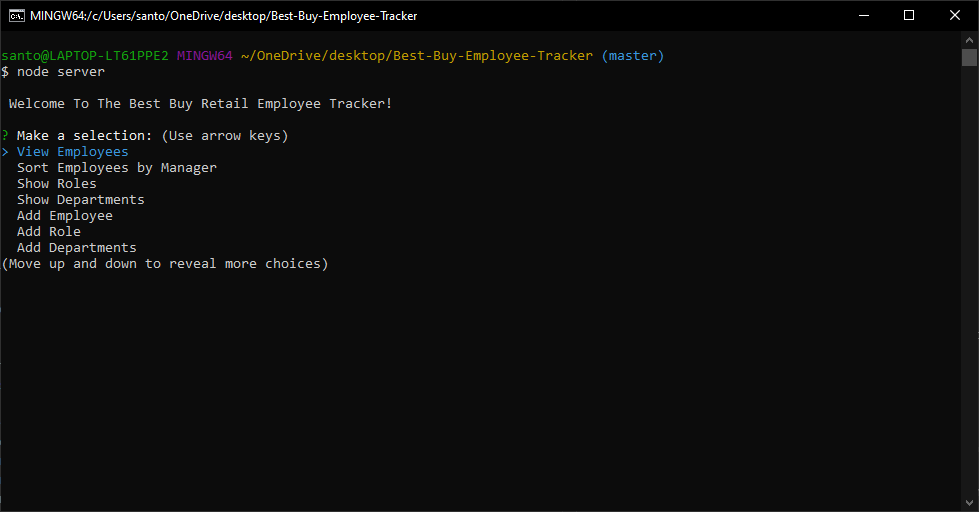

# Best-Buy-Employee-Tracker 

## Description
This application uses MySQL to control departments, roles, and employees. Although I created this app to manage a Best Buy retail store where I work currently, by changing the seeds.sql queries or through the interface the user can delete my seed and add departments, roles, and employees for their buisness instead.
### Table of Contents
-  [Title](#title)

-  [Description](#description)

-  [Installation](#installation)

-  [Usage](#usage)

-  [License](#license)

-  [Contributors](#contributors)

-  [Questions](#questions)
            
## Installation
1. Clone this repo
2. Run `npm install`          
3. Use MySQL to create database and add the schema in this repo to it
4. Populate the database with seeds.sql or add your own
5. Go into the server.js file in this project and change the password on line 12 to correspond with your own server
6. Run `node server.js`
## Usage
When the user views employees, then all employees with their information is displayed in a table.   
When the user sorts employees by manager, then they are prompted to select a manager and is presented with all employees managed under them.  
When the user views roles, then all roles are displayed in a table.   
When the user views departments, then all departments are displayed on a table.   
When the user adds employee, then they are prompted for their name, role, and their manager.   
When the user adds a role, they are prompted for the role name, salary, and department.  
When the user adds department, then they are prompted for the department name.   
When the user removes an employee, then they are prompted with a list of employees to remove.   
When the user removes a role, then they are prompted with a list of roles to remove.   
When the user removes an department, then they are prompted with a list of departments to remove.   

## License

## Contributing
No contributors yet but feel free to make a pull request.

## Questions
If anyone has any questions about my application please contact me below.

reedsantos@icloud.com

[Github link](https://github.com/ReedSantos)
